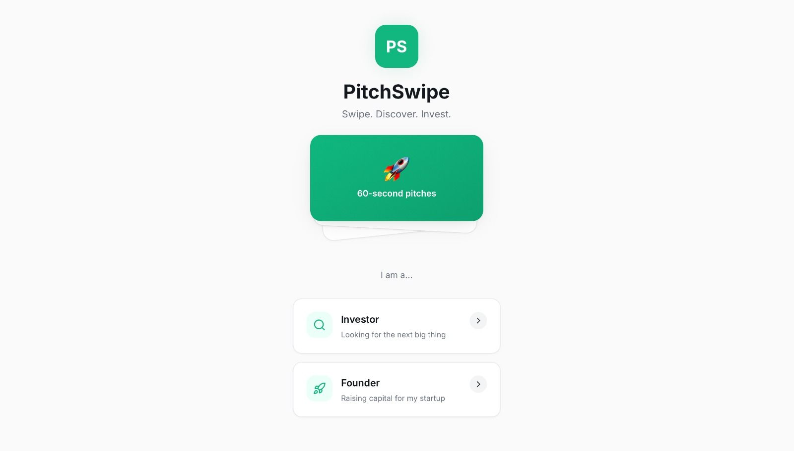
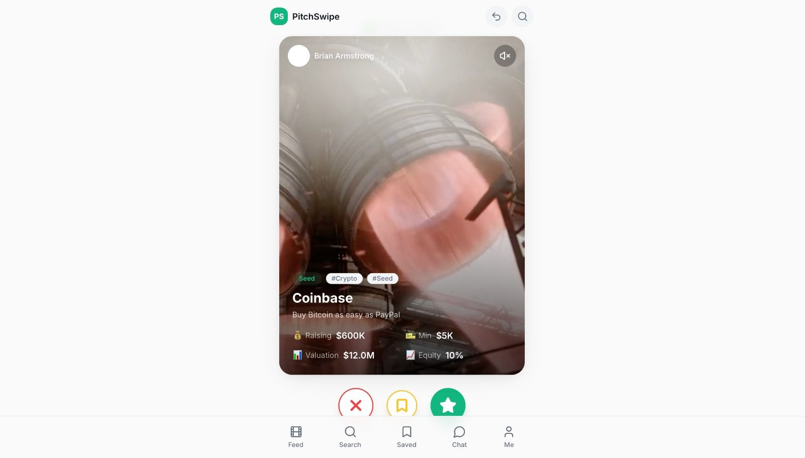
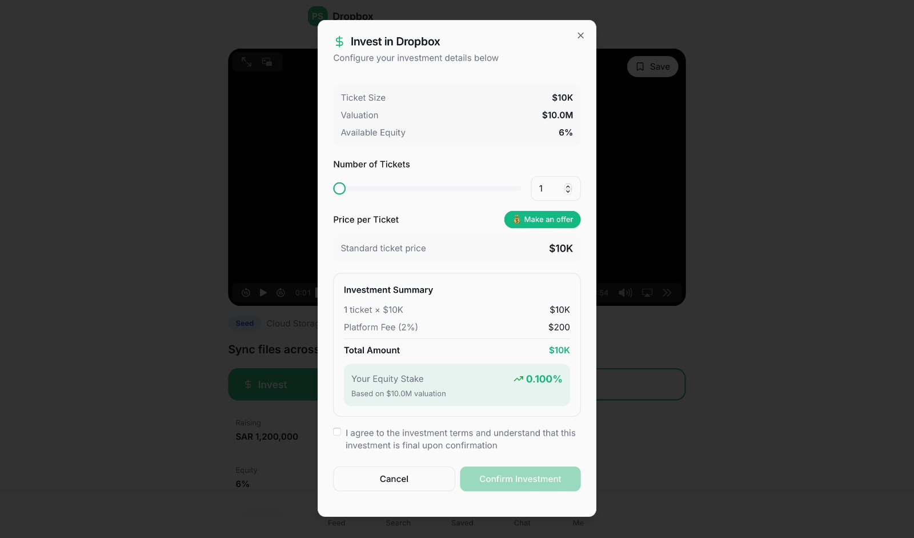
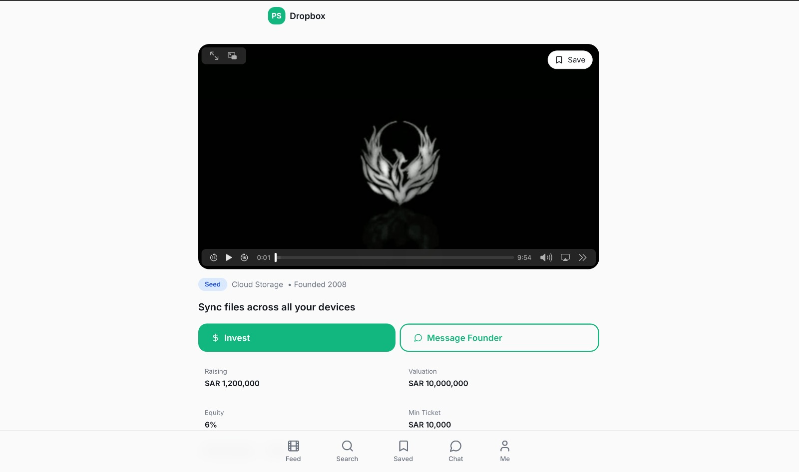
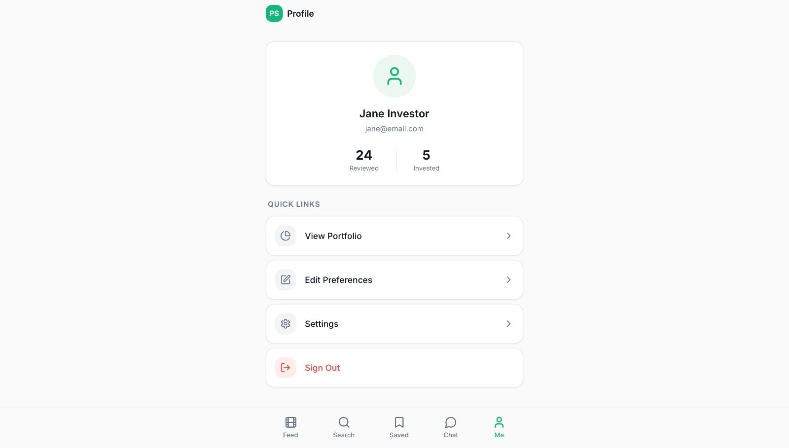

# PitchSwipe

**Reimagined Investing. Video-First Discovery. AI-Powered. Saudi-Focused.**

PitchSwipe is a revolutionary investment discovery platform built for the modern era and aligned with Saudi Vision 2030. It bridges the gap between founders and investors by replacing traditional, text-heavy PDFs and static spreadsheets with an intuitive, video-first experience. Think of it as the "TikTok for Startup Investing."

## 🚀 The Vision
Investors today are drowning in information but starving for relevance. PitchSwipe redesigns the experience for humans:
- **Founders** pitch through short, authentic vertical videos.
- **Investors** discover startups visually and intuitively.
- **Actionable Swipes**: 
  - *Swipe Left* to pass.
  - *Swipe Down* to discover another pitch.
  - *Swipe Right* to instantly unlock a company's deep profile and quickly invest.

## 🧠 Technical Architecture & Design Choices
To deliver a seamless, high-engagement experience, PitchSwipe is built on modern, scalable technical foundations carefully chosen for this hackathon:

### 1. Video-First Frontend Interface
- **Design Choice**: A high-performance, mobile-optimized UI tailored for vertical video scrolling, prioritizing fluid UX over dense dashboards.
- **Why**: Traditional platforms are built for analysts, not human consumption. A video-first interface leverages familiar gestures (swiping) to reduce friction, eliminate "investment fatigue," and significantly increase conversion rates among modern investors.

### 2. Behavioral-Finance AI (The Vector Engine)
- **Design Choice**: Real-time updating of investor preference vectors based directly on interaction metrics.
- **Why**: "People don't know what they want; their behavior reveals it." The system captures micro-interactions (watch time, skips, swipe directions, intent) to dynamically train user-specific AI vectors. This ensures investors see personalized deal flow, prioritizing the domains they authentically care about without requiring manual filter configurations.

### 3. Secure "Unlock" Mechanism & Event-Driven Data Pipeline
- **Design Choice**: Frictionless profile and financial data retrieval triggered asynchronously by user intent (Swipe Right).
- **Why**: Solves privacy and engagement simultaneously. Founders retain privacy until an investor displays verified interest. At that point, the system instantly streamlines the bidirectional flow of profile data to facilitate safe execution, minimizing steps to convert.

## 📸 Reference Designs & UI Mockups
*Note: Ensure to place the corresponding image files in the `reference_images/` folder relative to this README.*

1. 
   **PitchSwipe Main Menu:** A minimalist, clear entry point with a green card showing "60-second pitches" with a rocket emoji. Users can select between two distinct experiences:
   - **Investor**: Looking for the next big thing.
   - **Founder**: Raising capital for a startup.

2. 
   **The Video Pitch Screen (Vertical Scroll):** A TikTok-style full-screen video player where investors consume fast pitches. Showcasing metrics like Raising amount ($600K), Valuation ($12.0M), Min Ticket ($5K), and Equity (10%). Bottom action buttons include Reject (red X), Save (yellow bookmark), and Invest (green star).

3. 
   **Startup Profile Detail (Horizontal Video Layout):** A detailed view after "swiping right". Shows a high-definition video frame for deep analysis with clear call-to-actions: "$ Invest" and "Message Founder". Quick stats below highlight the critical financial details. 

4. 
   **The Investment Confirmation Modal:** A highly streamlined final transaction window. It lists dynamic options for the investor to adjust the "Number of Tickets" securely with a live calculation of the total amount (including Platform fees) and the updated Equity Stake%. Designed to minimize cognitive load before confirming the investment.

5. 
   **Investor Profile Dashboard:** Clean stats view reflecting the user's progress: "24 Reviewed" and "5 Invested". Quick settings, portfolio preview, and preference editor.

## 🌍 Why Saudi Arabia?
Built explicitly for the momentum of **Vision 2030**:
- Explosive regional startup growth & fintech adoption.
- Energized, youth-dominated population consuming massive amounts of video content.
- Government backing for digital transformation and enabling young retail investors to enter markets.

## 💼 Business Model & Roadmap
- **Monetization**: Founder onboarding & subscription fees + Investor success commissions (via regulated partners).
- **Target Audience**: Retail Investors, High Net Worth family offices, and Institutions.
- **Phase 1**: MVP Launch & AI Training. Focus on core loop.
- **Phase 2**: Fintech Sandbox Entry. 
- **Phase 3**: Regional Expansion.

---
*Attached in this repository:  - The complete project presentation deck.*
